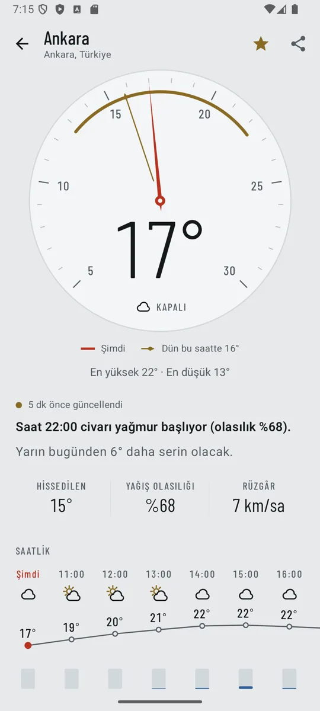
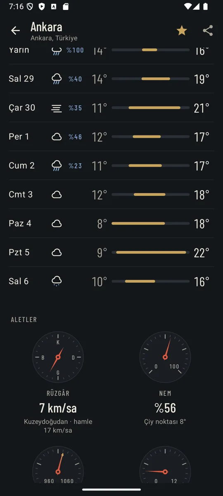
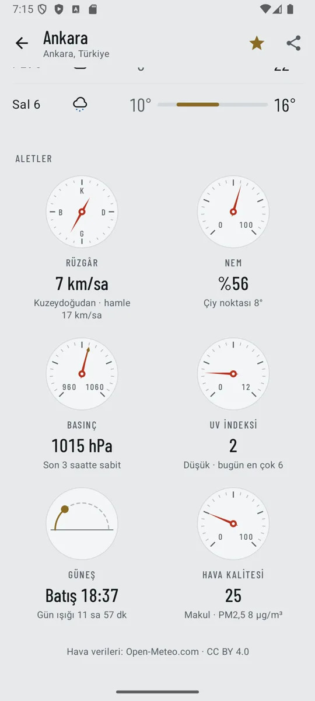
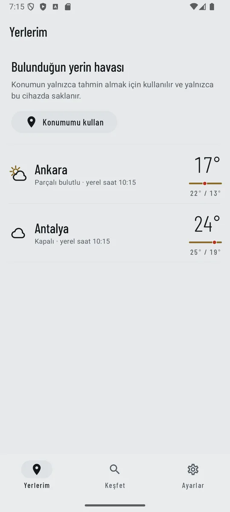
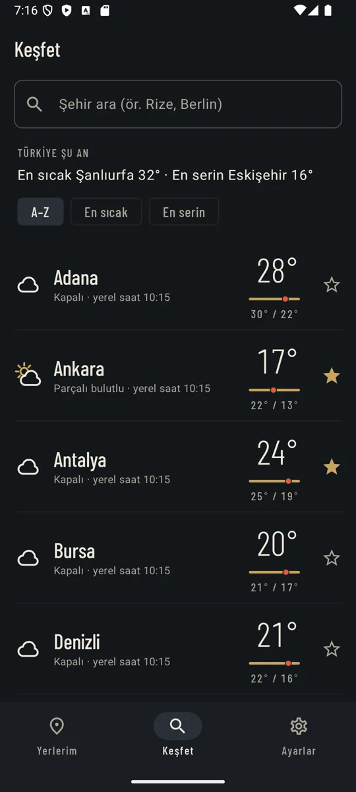

# Ufuk

Kamp+ (Turkcell Akademi) "Keşif Uygulaması" gereksinimlerinin hava durumu temalı yeniden yorumu. Kampta verilen taslak uygulamayla ([omerdm34/weather-app](https://github.com/omerdm34/weather-app), "Hava") aynı işi yapar: şehirlerin anlık havasını listeler, seçilen yerin saatlik ve günlük tahminini gösterir, kullanıcının yerlerini saklar, dünyanın her yerinde şehir arar ve yükleniyor / veri / boş / hata durumlarının hepsini ele alır.

Farkı, sayıları okunacak hale getirmesidir. Her yer, masa üstü bir hava istasyonunun kadranı gibi okunur:

- **Vermilyon ibre** şu anki sıcaklığı gösterir.
- **Pirinç ayar ibresi** dün aynı saatteki değeri gösterir.
- **Yaldız yay** bugünün en düşük–en yüksek aralığıdır.
- Kadranın altında test edilmiş kurallardan üretilen kısa cümleler yer alır: "Saat 22:00 civarı yağmur başlıyor (olasılık %68)", "Yarın bugünden 6° daha serin olacak".

| Tahmin | 10 gün | Aletler | Yerlerim | Keşfet |
|---|---|---|---|---|
|  |  |  |  |  |

Ekran görüntüleri Android 15 emülatöründe, Open-Meteo'nun gerçek verisiyle alınmıştır (27 Eylül 2026).

**Teknoloji:** Kotlin · Jetpack Compose (Material 3) · Clean Architecture · Coroutines & StateFlow · Hilt · Retrofit + kotlinx.serialization · Room · DataStore · Navigation Compose (type-safe). Sürümler taslakla birebir aynıdır.

## Özellikler

- **Tahmin ekranı:**
  - Sıcaklık kadranı.
  - Özet cümleleri: yağış başlıyor/diniyor, sert rüzgâr, don, yüksek UV, hissedilen fark, dün ve yarınla karşılaştırma.
  - 24 saatlik grafik (sıcaklık eğrisi + yağış çubukları).
  - Aynı ölçeği paylaşan 10 günlük aralık çubukları.
  - Alet takımı: rüzgâr pusulası, nem, 3 saatlik eğilimli barometre, UV, güneş yayı, Avrupa hava kalitesi indeksi.
- **Yerlerim:**
  - Cihaz konumu, ilk sırada. Google Play Services gerekmez; ad ters coğrafi kodlamayla bulunur.
  - Kaydedilen şehirler, hepsinin havası tek istekte gelir.
  - Kaydırarak silme ve her snackbar'ın kendi yerini geri getiren "Geri al".
- **Keşfet:**
  - Türkiye'nin 20 büyük şehri: A–Z / en sıcak / en serin sıralama ve "Türkiye şu an: en sıcak … en serin …" özeti.
  - Dünya çapında arama: 400 ms bekletmeli, yalnızca yerleşim yerleri (havalimanı ya da dağ zirvesi şehir gibi listelenmez).
- **Çevrimdışı çalışma:**
  - Son tahmin Room'da saklanır; ağ yokken ekran boşalmaz.
  - Eski veri her zaman yaşıyla birlikte gösterilir ("Güncellenemedi · 25 dk önceki veri"). İbre soluklaşır; bayat veri canlıymış gibi sunulmaz.
- **Ayarlar:** °C / °F ve km/sa · m/sn · mph (DataStore). Veri her zaman metrik saklanır, dönüşüm yalnızca gösterimde yapılır.
- **Dil:**
  - Türkçe (varsayılan) ve İngilizce.
  - Android 13+ "Uygulama dilleri" desteği.
  - Büyük harf dönüşümü cihaz diliyle yapılır ("İNDEKSİ", "HİSSEDİLEN").
- **Erişilebilirlik:**
  - Her satır ve her alet TalkBack'te tek cümle okunur.
  - Silme işlemi TalkBack özel eylemlerinde de var.
  - Sistem "Animasyonları kaldır" ayarı ibre salınımını kapatır.
  - Renk tek başına anlam taşımaz (UV ve hava kalitesi kademeleri yazıyla da verilir).

## Taslaktan farklar

Taslağı incelerken bulunan sorunlar ve Ufuk'taki karşılıkları:

| Taslakta | Ufuk'ta |
|---|---|
| Favorilerde art arda iki silmede ilk "Geri al" ikinci şehri geri getiriyor (tek `lastRemoved` alanı) | Silinen yer ve eski sırası snackbar olayıyla taşınır; birim testi ve Room testi var |
| OkHttp HTTP önbelleği işe yaramıyor (Open-Meteo `Cache-Control` göndermiyor) | Kaldırıldı; tahmin Room'da önbelleklenir, 10 dk tazelik ve 45 dk bayatlık kuralı domain'de |
| Yenileme başarısız olunca ekrandaki veri siliniyor | Ekran önbelleği izler, ağ yalnızca önbelleği tazeler; hata veriyi silmez |
| `isDay` alınıyor ama kullanılmıyor | Gece/gündüz ikonları (ay, güneş), saatlik grafikte saat saat |
| Aramada havalimanları ve dağlar şehir gibi çıkıyor | GeoNames `PPL*` süzgeci |
| Emoji ikonlar, tema dışı kart renkleri | Tek çizgi kalınlığında çizilmiş hava ikonları, iki tema da elle tasarlandı |
| Sabit metinler (`km/sa`, Türkçe gün adları) | Tüm metinler kaynakta, birimler ayarlanabilir, İngilizce çeviri |
| Favoriler ekranı hava göstermiyor | Yerlerim her yerin havasını ve bugünkü aralığını gösterir |

## Mimari

Taslaktaki yapı korunur: tek `:app` modülü, özellik öncelikli (feature-first) paketler, her özellikte `data / domain / presentation`. Bağımlılık yönü `presentation → domain ← data`. Ayrıntılar: [docs/ARCHITECTURE.md](docs/ARCHITECTURE.md).

```
core/      common (AppResult, AppError, ErrorMapper, Ticker) · model (Place, birimler)
           network · database · datastore · navigation · ui (tema, kadran çizimi, ikonlar, durum ekranları)
feature/   forecast  → tahmin verisi, özet kuralları, tüm hava ekranları
           places    → kayıtlı yerler, arama, cihaz konumu (yalnızca domain + data)
           settings  → birimler
```

`LayerDependencyTest` kuralları derleyici yerine kaynak kod üzerinden denetler:

- domain saf Kotlin'dir;
- presentation, data katmanını bilemez;
- bir özellik başka bir özelliğin yalnızca domain katmanını kullanabilir;
- ortak core, özellikleri bilemez.

## Çalıştırma

`local.properties` içinde `sdk.dir` tanımlı olmalı. Terminalden derlerken `JAVA_HOME` olarak Android Studio'nun JBR'ı kullanılabilir.

```bash
./gradlew assembleDebug              # debug APK
./gradlew testDebugUnitTest          # 79 unit test (mimari testi dahil)
./gradlew connectedDebugAndroidTest  # 6 cihaz testi: Room DAO'ları ve 1→2 şema geçişi
./gradlew spotlessCheck              # ktlint (düzeltmek için spotlessApply)
./gradlew lintDebug                  # Android lint, uyarılar hata sayılır
./gradlew assembleRelease            # R8 açık release APK (~2 MB)
```

Emülatörde konum denemek için:

```bash
adb emu geo fix 32.8597 39.9334
```

**Release imzası:** `keystore.properties.example` dosyasını `keystore.properties` olarak kopyalayıp doldurun (repoya girmez). Dosya yoksa release APK debug anahtarıyla imzalanır.

**Kurumsal ağ uyarısı:** TLS denetimi yapan ağlarda cihaz Open-Meteo sertifikasına güvenmez ve uygulama "İnternete ulaşılamıyor" der. Kamp öncesi misafir Wi-Fi ya da hotspot ile deneyin.

## Git

Git Flow kullanılır:

- Dallar: `main` ← `release/*` ← `develop` ← `feature/*`.
- Feature dalları `develop`'a `--no-ff` ile birleşir.
- Commit'ler Conventional Commits biçimindedir (`feat(detail): add temperature dial with live needle and yesterday set-hand`).
- Sürümler tag'lenir: `v1.0.0`.

Geçmişi görmek için:

```bash
git log --graph --oneline --all
```

PR'larda CI sırasıyla ktlint, unit test, lint ve debug derlemesi çalıştırır.

## Lisanslar ve atıf

- Hava verileri: [Open-Meteo](https://open-meteo.com/), CC BY 4.0. Ücretsiz kullanım ticari olmayan projeler içindir.
- Yazı tipi: Barlow Condensed, Jeremy Tribby, SIL Open Font License 1.1 ([docs/licenses](docs/licenses/OFL-BarlowCondensed.txt)).
